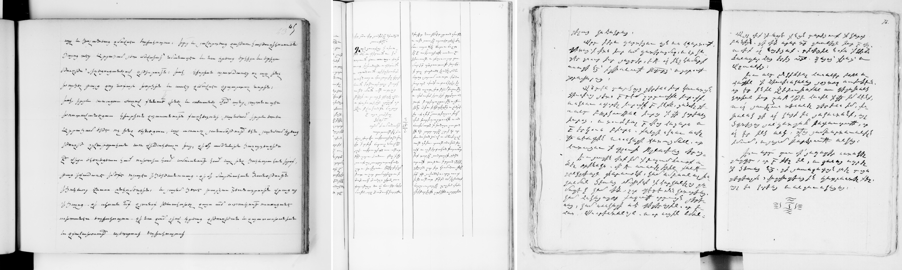
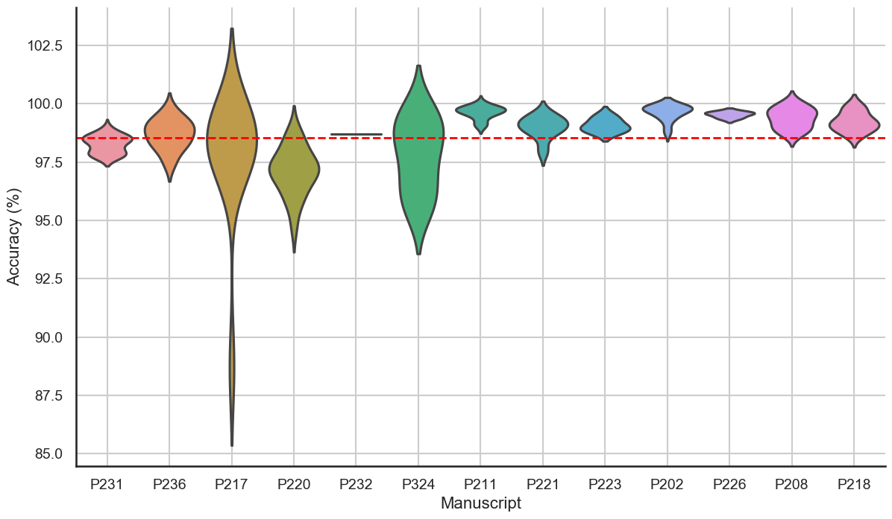
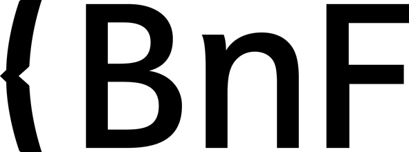
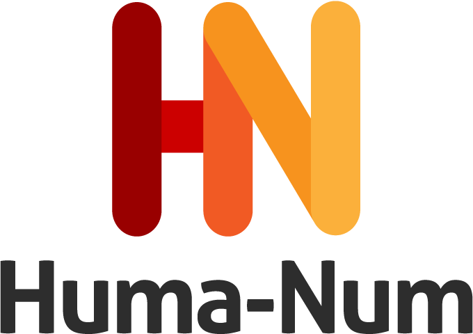
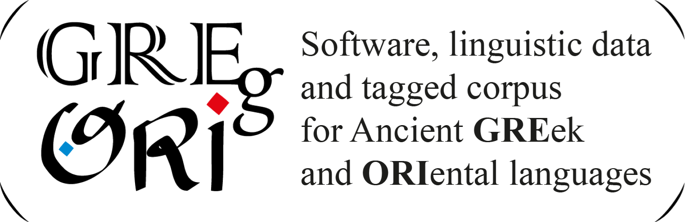
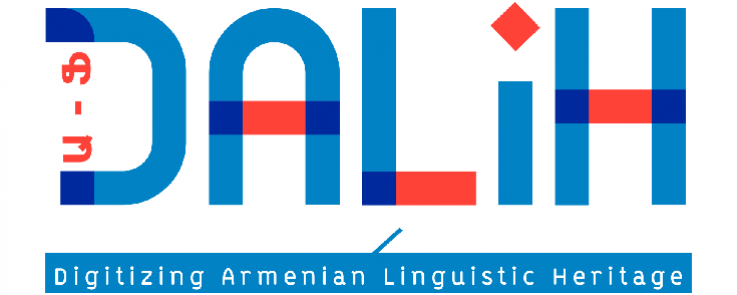

# Dulaurier dataset
Ground-truth of the Dulaurier project (HTR of Armenian manuscripts).

The dataset has been collated within the scope of the [Dulaurier project](https://calfa.fr/blog/39) (Valorisation numérique du fonds Dulaurier) led by [Calfa](https://calfa.fr) and sponsored by the BnF Datalab (call for projects 2022-2023), in partnership with [GREgORI](https://uclouvain.be/fr/instituts-recherche/incal/ciol/gregori-project.html) (University of Louvain).

The project involves the automatic transcription of 14 manuscripts from the Dulaurier collection at the BnF (around 3.600 images), as well as the automatic tagging of these texts (identification of proper nouns, lemmatisation, POS). The transcriptions are available on Gallica and searchable in the GREgoRI online corpora. Texts are focused on medieval Armenian historiography (e.g. Łevond, Movsēs Kalankatuac'i, Kirakos Ganjakec'i , etc.).

## Dataset composition

Dataset contains 42 images, for a total of:

* 148 TextRegions
* 1.467 TextLines
* 8.864 words
* 54.294 characters

Images consist in scanned microfilms. Four hands are representend (mainly Dulaurier hand and hands of his students).

<figure>
    
    <figcaption>ms. Arm. 226 (p. 55), ms. Arm. 231 (p. 126), and ms. Arm. 217 (p. 81) — Gallica, BnF</figcaption>
</figure>


## Images
BnF Images are available through its IIIF server. For the list of IDs (images and documents), see the `list-images.tsv` file. To request an image, please use the following URL template:

```
https://gallica.bnf.fr/iiif/ark:/12148/{document_ID}/f{image_ID}/{region}/{size}/{rotation}/{quality}.{format}
```

## Ground-truth specifications

### Informations levels

We provide for each image a pageXML file containing three level of information:
* TextRegion localisation, with a semantic tag (e.g. `MainText`), following the [SegmOnto ontology](https://github.com/SegmOnto/Guidelines);
* Baseline localisation and surrounding polygon of the line;
* Text.

```xml
    <TextRegion id="80735" custom="structure {type:MainText;}">
      <Coords points="2656,438 2664,3362 410,3472 403,3095 403,2903 363,2705 312,402 2656,438"/>
      <TextLine id="879019">
        <Coords points="322,485 320,520 526,524 579,504 616,518 722,506 757,524 802,516 845,532 937,512 1039,512 1078,530 1114,516 1141,528 1174,518 1245,540 1353,520 1443,520 1555,547 1753,551 1817,540 1858,553 1960,542 2154,555 2207,536 2401,553 2433,540 2658,542 2662,522 2658,473 2578,473 2456,444 2327,467 2239,440 2194,449 2150,426 2062,453 1992,424 1804,457 1692,457 1660,440 1555,451 1441,412 1247,408 1151,424 1098,420 1049,438 961,416 882,438 845,428 779,436 645,400 575,432 475,432 322,389 322,485"/>
        <Baseline points="323,486 814,477 1764,520 2664,524"/>
        <TextEquiv>
          <Unicode>չգալ կենարարին մերոյ ք[րիստոս]ի և յետ դարձի Յիսուբա</Unicode>
        </TextEquiv>
      </TextLine>
```

Annotations have been made on the [Calfa Vision platform](https://vision.calfa.fr), a free web-based annotation tool for documents and images designed for Oriental scripts.

The transcription is faithful to the text present in the image, including when the word is misspelled.
We do not follow the *scriptio continua* of Armenian manuscripts and we re-establish a separation between words. We expand abbreviations and ideograms used in the manuscripts, by using brackets, to allow keyword search and abbreviations understanding. For instance:

* քի will be transcribed ք[րիստոս]ի
* ~ն will be transcribed [աշխարհ]ն
* քղք will be transcribed ք[ա]ղ[ա]ք
etc.

## Some results

Paper WIP.
Preliminary results have been presentend at the Bibliothèque nationale de France in [January 2024](https://bnf.hypotheses.org/37691).
With this dataset, we reach a mean accuracy of good recognition of 98,56% (and 92,9% of good reading of abbreviations).

<figure>
    
    <figcaption>Accuracy per manuscript with models trained with this dataset</figcaption>
</figure>

For now, processed texts have been analyzed (lemmatisation and POS-tagging) and are searchable on [GREgORI interfaces](https://v2.gregoriproject.com) (Ancient Armenian Corpus). Results are linked to [Gallica](https://gallica.bnf.fr) and [Calfa dictionaries](https://dictionary.calfa.fr). Proofreading will be carried out in 2024.


## Further readings

Please find below related publications to this project or to HTR / Text Analysis developments for Classical Armenian.

* Vidal-Gorène, C., & Kindt, B. (2020, May). Lemmatization and POS-tagging process by using joint learning approach. Experimental results on Classical Armenian, Old Georgian, and Syriac. In Proceedings of LT4HALA 2020-1st Workshop on Language Technologies for Historical and Ancient Languages (pp. 22-27). [see on ACL](https://aclanthology.org/2020.lt4hala-1.4.pdf)

* Kindt, B., & Vidal-Gorène, C. (2022). An Automated Process for Ancient Armenian or Other Under-Resourced Languages of the Christian East. Armeniaca, International Journal of Armenian Studies, 1 (pp. 73-96). [see on Armeniaca](https://edizionicafoscari.unive.it/media/pdf/article/armeniaca/2022/1/art-10.30687-arm-2974-6051-2022-01-005_lMiAeVT.pdf)

* Kindt, B., & Kepeklian, G. (2022, June). Analyse Automatique de l'Ancien Arménien. Évaluation d'une méthode hybride «dictionnaire» et «réseau de neurones» sur un Extrait de l'Adversus Haereses d'Irénée de Lyon. In Proceedings of the Workshop on Processing Language Variation: Digital Armenian (DigitAm) within the 13th Language Resources and Evaluation Conference (pp. 13-20). [see on ACL](https://aclanthology.org/2022.digitam-1.3.pdf)

* Vidal-Gorène, C., Dupin, B., Decours-Perez, A., & Riccioli, T. (2021). A modular and automated annotation platform for handwritings: evaluation on under-resourced languages. In Document Analysis and Recognition–ICDAR 2021: 16th International Conference, Lausanne, Switzerland, September 5–10, 2021, Proceedings, Part III 16 (pp. 507-522). Springer International Publishing.

## Acknowledgments

This work was carried out with the support of the BnF Datalab, in partnership with the GREgORI project and ANR DALiH.

     
